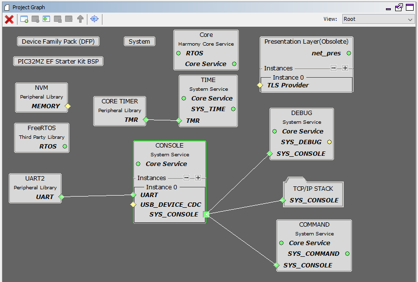
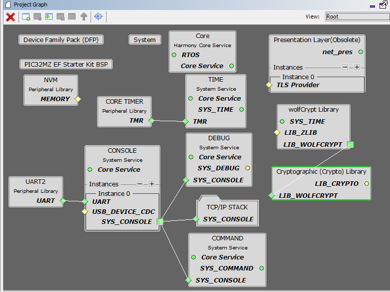
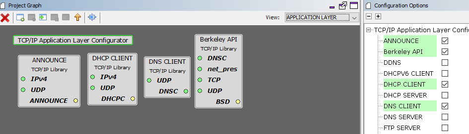
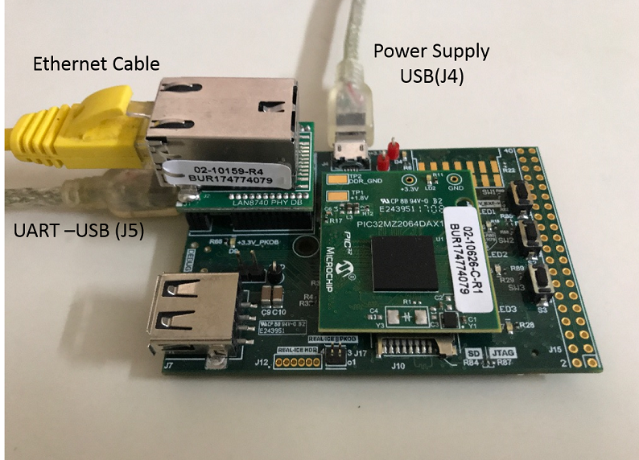

# TCP/IP Berkeley UDP Server

The Berkeley UDP Server configuration demonstrates creating a network client with the Berkeley API to make a UDP/IP connection to a specified port.

**TCP/IP Berkeley UDP Server MHC Configuration**

The following Project Graph diagram shows the Harmony components included in this application demonstration.

-   MHC is launched by selecting **Tools \> Embedded \> MPLAB® Harmony 3 Configurator** from the MPLAB X IDE and after successful database migration , TCP/IP demo project is ready to be configured and regenerated.

    

-   **TCP/IP Root Layer Project Graph**

    The root layer project shows that UART2 peripheral is selected to do read and write operation for TCP/IP commands.

    This is the basic configuration with SYS\_CONSOLE, SYS\_DEBUG and SYS\_COMMAND modules. These modules are required for TCP/IP command execution.

    

    **FreeRTOS** component is required for RTOS application. For bare-metal \(non-RTOS\) **FreeRTOS** component should not be selected.

    **NOTE** - The above diagram contains **FreeRTOS** component and that is required for RTOS application. For bare-metal\(non-RTOS\) **FreeRTOS** component shouldn't be selected.

    

-   **TCP/IP Required Application**

    TCP/IP demo use these application module components for this demo.

    **Announce** module to discover the Microchip devices within a local network.

    **DHCP Client** module to discover the IPv4 address from the nearest DHCP Server.

    **DNS Client** provides DNS resolution capabilities to the stack.

    **Berkeley API** module provides the Berkeley\_Socket\_Distribution \(BSD\) wrapper to the native Microchip TCP/IP Stack APIs. During this component selection, the required transport and network modules are also selected.

    

-   **TCPIP Driver Layer**

    **Internal ethernet driver\(ethmac\)** is enabled with the external **LAN8740 PHY driver** library. The MIIM Driver supports asynchronous read/write and scan operations for accessing the external PHY registers and notification when MIIM operations have completed.

    

**TCP/IP Berkeley UDP Server Hardware Configuration**

This is the following section describes the hardware configurations and one of the configuration can be used for this application demonstration.

1.  This section describes the PIC32MZ EF device default hardware configuration use USB device as **on board debugger and programmer** for this application demonstration.

    -   Refer to the PIC32MZ EF Ethernet Starter Kit [User Guide](http://ww1.microchip.com/downloads/en/devicedoc/70005230b.pdf)

        

    -   No hardware related configuration or jumper setting changes are necessary. Connect the mini USB cable from the computer to the USB DEBUG connector on the PIC32MZ EF Ethernet Starter Kit

    -   Connect the mini USB cable from the computer to the USB-UART connector on the PIC32MZ EF Starter Kit

    -   Establish a connection between the router/switch with the PIC32MZ EF Starter Kit through the RJ45 connector on PHY daughter board

2.  This section describes the PIC32MZ EF device hardware configuration with the combination of **RealICE, or ICD4** and the Starter Kit I/O Expansion Board for debugging and programming for this application demonstration.

    

    -   Connect the 168 pin to 132 pin Starter Kit Adapter board to the Starter Kit I/O Expansion Board, optionally use a nylon nut and bolt to secure the two boards together

    -   Connect the PIC32MZ Extended Connectivity w/FPU \(EF\) Starter kit to the 168 pin to 132 pin Starter Kit Adapter board, optionally use a nylon nut and bolt to secure the two boards together

    -   Connect the RealICE, or ICD to the RJ-11 port on the Starter Kit I/O Expansion Board

    -   Connect a USB Mini-b \(5 pin\) cable to the DEBUG USB port connect an Ethernet cable to the Ethernet Port

    -   Connect the 9V power supply to the Starter Kit I/O Expansion Board

3.  This section describes the PIC32MZ DA device default hardware configuration which use USB device as **on board debugger and programmer** for this application demonstration.

    -   Refer to the PIC32MZ DA Ethernet Starter Kit [User Guide](http://ww1.microchip.com/downloads/en/DeviceDoc/70005311A.pdf) for the programming/debugging options supported.

        

    -   No hardware related configuration or jumper setting changes are necessary. Connect the mini USB cable from the computer to the USB DEBUG connector on the PIC32MZ DA Ethernet Starter Kit

    -   Connect micro USB cable from the computer to the USB connector\(J4\) on the PIC32MZ DA Starter Kit

    -   Connect micro USB cable from the computer to the USB-UART connector\(J5\) on the PIC32MZ DA Starter Kit

    -   Establish a connection between the router/switch with the PIC32MZ DA Starter Kit through the RJ45 connector on PHY daughter board

**TCP/IP Berkeley UDP Server Application**

This table list the name and location of the MPLAB X IDE project folder for the demonstration.

|Project Name|Target Device|Target Development Board|Description|
|------------|-------------|------------------------|-----------|
|pic32mz\_ef\_sk\_freertos.X|PIC32MZ2048EFH144|PIC32MZ EF Starter Kit|Demonstrates the Berkeley UDP Server on development board with PIC32MZ2048EFH144 device and LAN8740 PHY daughter board. This implementation is based on FreeRTOS.|
|pic32mz\_da\_sk|PIC32MZ2064DAS169|PIC32MZ DA Starter Kit|Demonstrates the Berkeley UDP Server on development board with PIC32MZ2064DAS169 device and LAN8740 PHY daughter board. This implementation is based on bare-metal\(non-RTOS\).|
|pic32mz\_da\_sk\_freertos.X|PIC32MZ2064DAS169|PIC32MZ DA Starter Kit|Demonstrates the Berkeley UDP Server on development board with PIC32MZ2064DAS169 device and LAN8740 PHY daughter board. This implementation is based on FreeRTOS.|

**Running Demonstration Steps**

1.  Build and download the demonstration project on the target board.

2.  If the board has a UART connection:

    1.  A virtual COM port will be detected on the computer, when the USB cable is connected to USB-UART connector.

    2.  Open a standard terminal application on the computer \(like Hyper-terminal or Tera Term\) and configure the virtual COM port.

    3.  Set the serial baud rate to 115200 baud in the terminal application.

    4.  See that the initialization prints on the serial port terminal.

    5.  When the DHCP client is enabled in the demonstration, wait for the DHCP server to assign an IP address for the development board. This will be printed on the serial port terminal.

        -   Alternatively: Use the Announce service or ping to get the IP address of the board.

        -   Run **tcpip\_discoverer.jar** to discover the IPv4 and IPv6 address for the board.

3.  Execution :

    -   As soon as a valid IP address is assigned through the DHCP to the demonstration, it is ready to accept a UDP/IP connection on port 9760.

    -   Send a UDP packet to the IP address of the hardware board and port 9760 from any UDP Client application running on the computer.

**Parent topic:**[MPLAB® Harmony 3 TCP/IP Application for PIC32MZ Family](../../docs/GUID-E3619664-D1A4-427D-A50A-7CBF1634F410.md)

