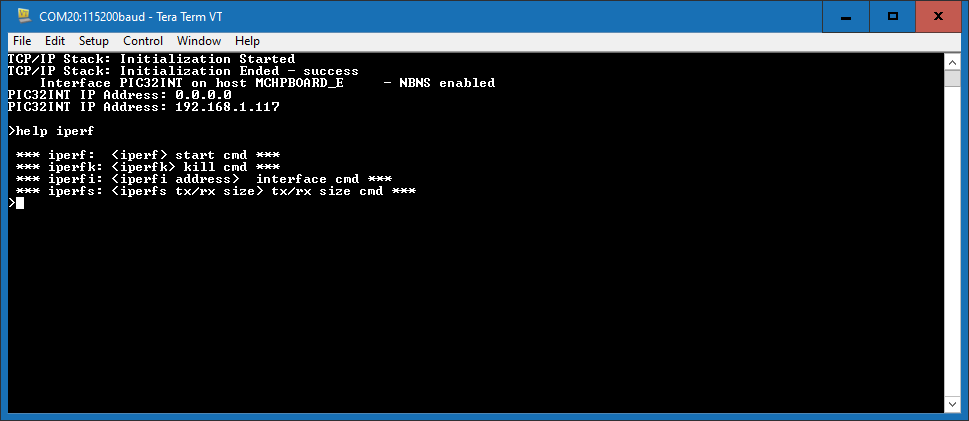

# TCP/IP IPERF Running Application

## MPLAB X IDE Project
This table list the name and location of the MPLAB X IDE project folder for the demonstration.

|Project Name|  Target Device|  Target Development Board | Description  |
|:-------------:|:---------:|:---------:|:---------:|
|pic32mz_ef_sk.X | PIC32MZ2048EFH144 | PIC32MZ EF Starter Kit |Demonstrates the TCP/IP iperf demo on a development board with PIC32MZ2048EFH144 device and LAN8740 PHY daughter board. This implementation is based on baremetal( non-RTOS ).   |
|pic32mz_ef_sk_freertos.X | PIC32MZ2048EFH144 | PIC32MZ EF Starter Kit |Demonstrates the TCP/IP iperf demo on a development board with PIC32MZ2048EFH144 device and LAN8740 PHY daughter board. This implementation is based on FreeRTOS.   |
|pic32mz_da_sk.X | PIC32MZ2064DAS169 | PIC32MZ DA Starter Kit |Demonstrates the TCP/IP iperf demo on a development board with PIC32MZ2064DAS169 device and LAN8740 PHY daughter board. This implementation is based on baremetal( non-RTOS ).   |
|pic32mz_da_sk_freertos.X | PIC32MZ2064DAS169 | PIC32MZ DA Starter Kit |Demonstrates the TCP/IP iperf demo on a development board with PIC32MZ2064DAS169 device and LAN8740 PHY daughter board. This implementation is based on FreeRTOS.   |

## Running The Demonstration

1. Configure the Development Board as given  **[Configure Hardware](readme_hardware_configuration.md)**.

2. Make the demonstration setup as shown [Network Setup](../../readme.md).

3. Build and download the demonstration project on the target board.

4. If the board has a UART connection:

    1. A virtual COM port will be detected on the computer, when the USB cable is connected to USB-UART connector.

    2. Open a standard terminal application on the computer (like Hyper-terminal or Tera Term) and configure the virtual COM port.

    3. Set the serial baud rate to 115200 baud in the terminal application.

    4. See that the initialization prints on the serial port terminal.

    5. When the DHCP client is enabled in the demonstration, wait for the DHCP server to assign an IP address for the development board. This will be printed on the serial port terminal.

		* Alternatively: Use the Announce service or ping to get the IP address of the board.

        * Run **tcpip_discoverer.jar** to discover the IPv4 and IPv6 address for the board.
        
5. Execution :

    * The iperf demo is interactive, using a set of special iperf commands that are supported by the standard set of TCP/IP commands.

    * Pressing "help iperf" at the command prompt displays the list of the available iperf commands/options:

        

    - A brief description of the most important settings/commands follows:

        * "iperf": starts the iperf session. Use "iperf -s" for a server connection or "iperf -c address" for a client connection

            * Look at the Iperf Module for examples of iperf benchmarks

        * "iperfk" kills an ongoing iperf test. This is mainly useful for killing a iperf server waiting for connections. But the command could be also used to abort client test.

        * "iperfi -a address" allows to set the interface to use for iperf when the test is run on a multi-interface host. When multiple iperf instabces are used, the extra parameter "-i" could be used to specify the iperf index to which the command refers to.

        * "iperfs" command could be used to set the socket TX or RX buffer size dynamically. For example:

            * "iperfs -tx 2048"

    **Note:**  
    * The iperf demo uses very few TCP/IP modules, to minimize the stack overhead and to obtain good throughput numbers.

        * However ICMP server, NBNS and Announce modules are enabled to assist in the discovery of the board on the network.

        * DHCP client is also enabled for acquiring a valid IP address within the network.

        * Some of these modules could be further disabled if they are not used in the specific network environment of the application.

    * The data throughput could vary dependent on the iperf socket settings and the network conditions.

        * Larger TX and RX buffers will increase the corresponding throughput.

        * Various devices on the network on the link between the board and the machine running the iperf application (switches, routers, etc.) could also affect the throughput.

        * User can eliminate these effects by connecting the board running the iperf demo directly to the machine running the test on the PC side (Linux, Windows, etc.)
