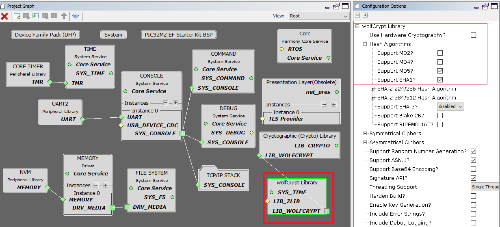

# TCP/IP SNMP NVM MPFS Application MHC Configuration

The following Project Graph diagram shows the Harmony components included in the application demonstration.

* MHC is launched by selecting **Tools > Embedded > MPLAB® Harmony 3 Configurator** from the MPLAB X IDE and after successful database migration , TCP/IP demo project is ready to be configured and regenerated.

    

* **TCP/IP Root Layer Project Graph**

  The root layer project shows that UART2 peripheral is selected to do read and write operation for TCP/IP commands.

  This is the basic configuration with SYS_CONSOLE, SYS_DEBUG and SYS_COMMAND modules. These modules are required for TCP/IP command execution.

  
  
  **FreeRTOS** component is required for RTOS application. For bare-metal (non-RTOS) **FreeRTOS** component should not be selected.

  The file system component is required to select MPFS module. This is the below snapshot for the FS configuration.

  

  TCP sockets calculate the ISN using the wolfSSL crypto library. 
	
* **TCP/IP Required Application**

    TCP/IP demo use these application module components for this demo.   
    
    **Announce** module to discover the Microchip devices within a local network.
    
    **DHCP Client** module to discover the IPv4 address from the nearest DHCP Server. 
    
    **HTTPNET** module is selected to run the web_server for the port number **80**. 
    
    **SNMP** and **SNMPv3** are an application layer protocols that facilitates the exchange of management information among network devices.     

    

    **Maximum SNMP Message Size** can be increased and the value should be multiple of 32 bytes for larger GET-Bulk response.

* **TCPIP Driver Layer**

  **Internal ethernet driver(ethmac)** is enabled with the external **LAN8740 PHY driver** library. The MIIM Driver supports asynchronous read/write and scan operations for accessing the external PHY registers and notification when MIIM operations have completed.

    
