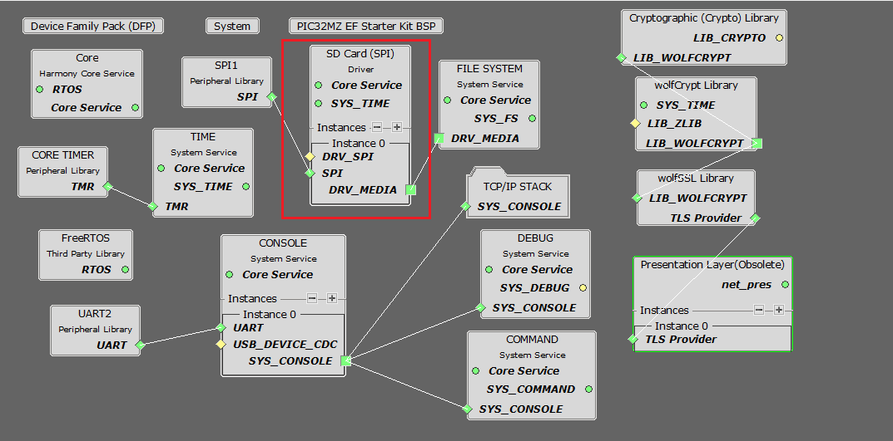
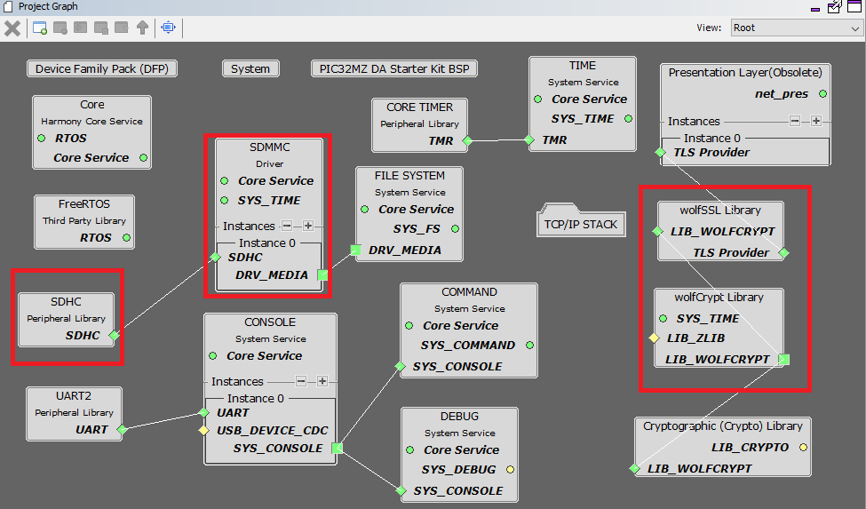
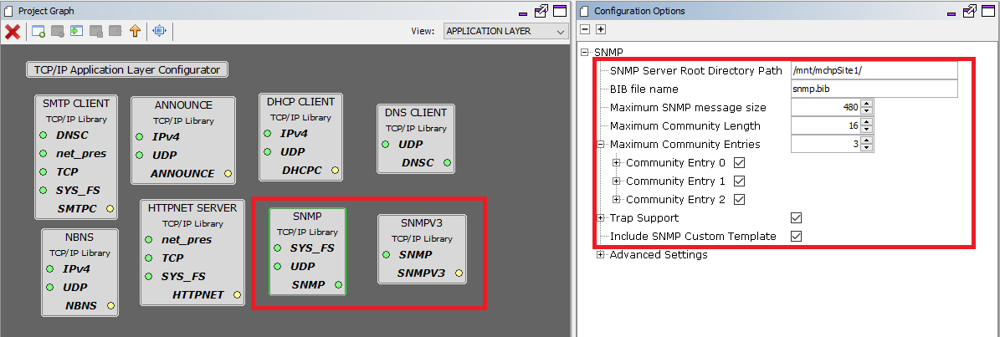

# TCP/IP SNMP SDCARD FATFS MHC Configuration

The following Project Graph diagram shows the Harmony components included in the application demonstration.

* MHC is launched by selecting **Tools > Embedded > MPLAB® Harmony 3 Configurator** from the MPLAB X IDE and after successful database migration , TCP/IP demo project is ready to be configured and regenerated.

    

* **TCP/IP Root Layer Project Graph**

	* PIC32MZ EF Device performs read/write to an SD card using SDSPI Module 

		SDSPI module is selected with SPI peripheral. 
        
        SDSPI driver uses an instance of the SPI driver to communicate to the SD card over the SPI bus. 
        
        The TCP/IP application demonstrates FAT file system to read/write to an SD card using SDSPI driver. SNMP and WebServer demo applications use SPI peripheral to read/write from SDMMC module.

        

	* PIC32MZ DA device performs read/write to an SD card using SDMMC driver. SNMP and WebServer demo applications use SDMMC driver to read/write from SDHC peripheral module.

        

        Wolfssl crypto module enabled with MD5,SHA authentication  and AES encryption/decryption privacy protocol are enabled. Wolfssl library used a open a secured socket.
	
        

        **FreeRTOS** component is required for RTOS application. For bare-metal (non-RTOS) **FreeRTOS** component should not be selected.

        
        
        TCP sockets calculate the ISN using the wolfSSL crypto library. 

* **TCP/IP Required Application**

	TCP/IP demo use these application module components for this demo.
    
    **Announce** module to discover the Microchip devices within a local network.
    
    **DHCP Client** module to discover the IPv4 address from the nearest DHCP Server. 
    
    **HTTPNET** module is selected to run the web_server for the port number **443**. 
    
    **SNMP** and **SNMPv3** are an application layer protocols that facilitates the exchange of management information among network devices.     

    

    **Maximum SNMP Message Size** can be increased and the value should be multiple of 32 bytes for larger GET-Bulk response.

* **TCPIP Driver Layer**

  **Internal ethernet driver(ethmac)** is enabled with the external **LAN8740 PHY driver** library. The MIIM Driver supports asynchronous read/write and scan operations for accessing the external PHY registers and notification when MIIM operations have completed.

    
