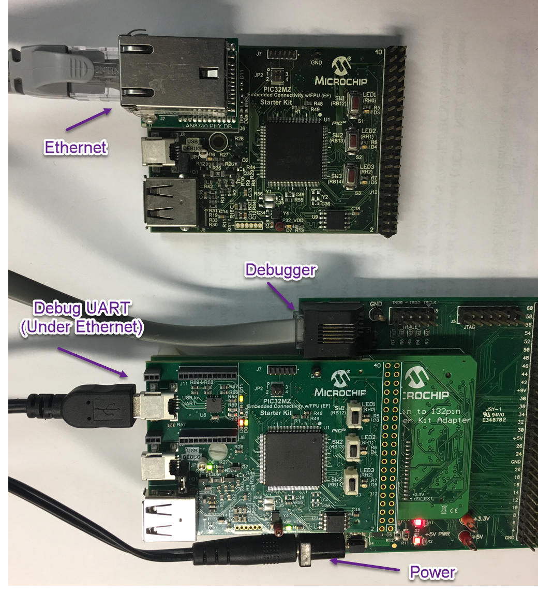

# TCP/IP TCP Client Hardware Configuration

This is the following section describes the hardware configurations and one of the configuration can be used for this application demonstration.

1. This section describes the PIC32MZ EF device default hardware configuration use USB device as **on board debugger and programmer** for this application demonstration.

    * Refer to the PIC32MZ EF Ethernet Starter Kit [User Guide](http://ww1.microchip.com/downloads/en/devicedoc/70005230b.pdf)

      

    * No hardware related configuration or jumper setting changes are necessary.
    Connect the mini USB cable from the computer to the USB DEBUG connector on the PIC32MZ EF Ethernet Starter Kit

    * Connect the mini USB cable from the computer to the USB-UART connector on the PIC32MZ EF Starter Kit

    * Establish a connection between the router/switch with the PIC32MZ EF Starter Kit through the RJ45 connector on PHY daughter board

2. This section describes the PIC32MZ EF device hardware configuration with the combination of **RealICE, or ICD4** and the Starter Kit I/O Expansion Board for debugging and programming for this application demonstration.

    

    * Connect the 168 pin to 132 pin Starter Kit Adapter board to the Starter Kit I/O Expansion Board, optionally use a nylon nut and bolt to secure the two boards together

    * Connect the PIC32MZ Extended Connectivity w/FPU (EF) Starter kit to the 168 pin to 132 pin Starter Kit Adapter board, optionally use a nylon nut and bolt to secure the two boards together

    * Connect the RealICE, or ICD to the RJ-11 port on the Starter Kit I/O Expansion Board

    * Connect a USB Mini-b (5 pin) cable to the DEBUG USB port
    connect an Ethernet cable to the Ethernet Port

    * Connect the 9V power supply to the Starter Kit I/O Expansion Board

3. This section describes the PIC32MZ DA device default hardware configuration use USB device as **on board debugger and programmer** for this application demonstration.

    * Refer to the PIC32MZ DA Ethernet Starter Kit [User Guide](http://ww1.microchip.com/downloads/en/DeviceDoc/70005311A.pdf) for the programming/debugging options supported.

      

    * No hardware related configuration or jumper setting changes are necessary.
    Connect the mini USB cable from the computer to the USB DEBUG connector on the PIC32MZ DA Ethernet Starter Kit

    * Connect micro USB cable from the computer to the USB connector(J4) on the PIC32MZ DA Starter Kit

    * Connect micro USB cable from the computer to the USB-UART connector(J5) on the PIC32MZ DA Starter Kit 

    * Establish a connection between the router/switch with the PIC32MZ DA Starter Kit through the RJ45 connector on PHY daughter board 

