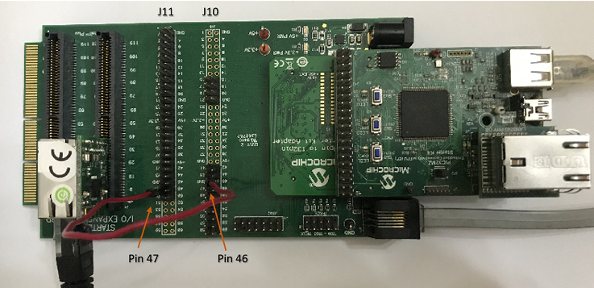

# TCP/IP TCP Server Hardware Configuration

This is the following section describes the hardware configurations and one of the configuration can be used for this application demonstration.

1. This section describes the PIC32MZ EF device default hardware configuration use USB device as **on board debugger and programmer** for this application demonstration.

    * Refer to the PIC32MZ EF Ethernet Starter Kit [User Guide](http://ww1.microchip.com/downloads/en/devicedoc/70005230b.pdf)

      

    * No hardware related configuration or jumper setting changes are necessary.
    Connect the mini USB cable from the computer to the USB DEBUG connector on the PIC32MZ EF Ethernet Starter Kit

    * Connect the mini USB cable from the computer to the USB-UART connector on the PIC32MZ EF Starter Kit

    * Establish a connection between the router/switch with the PIC32MZ EF Starter Kit through the RJ45 connector on PHY daughter board

2. This section describes the PIC32MZ EF device hardware configuration with the combination of **RealICE, or ICD4** and the Starter Kit I/O Expansion Board for debugging and programming for this application demonstration.

    

    * Connect the 168 pin to 132 pin Starter Kit Adapter board to the Starter Kit I/O Expansion Board, optionally use a nylon nut and bolt to secure the two boards together

    * Connect the PIC32MZ Extended Connectivity w/FPU (EF) Starter kit to the 168 pin to 132 pin Starter Kit Adapter board, optionally use a nylon nut and bolt to secure the two boards together

    * Connect the RealICE, or ICD to the RJ-11 port on the Starter Kit I/O Expansion Board

    * Connect a USB Mini-b (5 pin) cable to the DEBUG USB port
    connect an Ethernet cable to the Ethernet Port

    * Connect the 9V power supply to the Starter Kit I/O Expansion Board

3. This section describes PIC32MZ EF device hardware configuration for **external Ethernet controller ENC28J60** with PIC32MZ2048EFH144 development board.

    * Refer to the PIC32MZ EF Ethernet Starter Kit [User Guide](http://ww1.microchip.com/downloads/en/devicedoc/70005230b.pdf)

    * Refer to the ENC28j60 External Ethernet PICtail Plus Daughter Board [User Guide][https://www.microchip.com/developmenttools/ProductDetails/AC164123]

    * Refer to Starter Kit I/O Expansion Board [User Guide][https://www.microchip.com/developmenttools/ProductDetails/DM320002]

    The 10 Mbps Ethernet PICtail Plus Daughter Board is inserted to J2(or J4) on the Starter Kit I/O Expansion Board. The J2, PICtail Plus (SPI) connector on Ethernet PICtail Plus Daughter Board is attached to I/O Expansion Board. The PICtail daughter board is inserted to use SPI1.

    The PIC32MZ Embedded Connectivity with FPU (EF) Starter Kit is connected to J1 on the Starter Kit I/O Expansion board.

    The pin 46 on J10 and pin 47 on J11 (on I/O Expansion board) need to be connected to control the Chip-Select ( GPIO RE9 configuration ) line by the PIC32.

    To power the set-up, connect the micro USB cable from the computer to the micro-A/B port J4 on the PIC32MZ EF Starter Kit

    For serial console, connect the mini USB cable from the computer to the USB-UART connector on the PIC32MZ EF Starter Kit

    Please refer to the following figure for GPIO PIN RE9.

    

    Please refer to the following figure for GPIO PIN RH12 ( without Jumper).

    

4. This section describes PIC32MZ EF device hardware configuration for **external Ethernet controller ENC624J600** with PIC32MZ2048EFH144 development board.

    * Refer to the PIC32MZ EF Ethernet Starter Kit [User Guide](http://ww1.microchip.com/downloads/en/devicedoc/70005230b.pdf)

    * Refer to the ENCX24j600 External Ethernet PICtail Plus Daughter Board [User Guide][https://www.microchip.com/developmenttools/ProductDetails/AC164132]

    * Refer to Starter Kit I/O Expansion Board [User Guide][https://www.microchip.com/developmenttools/ProductDetails/DM320002]

    The Fast 100Mbps Ethernet PICtail Plus Daughter Board is inserted to J2(or J4) on the Starter Kit I/O Expansion Board. The J2, PICtail Plus (SPI) connector on Fast 100Mbps Ethernet PICtail Plus Daughter Board is attached to I/O Expansion Board with white arrows on the two boards lined up. The PICtail daughter board is inserted to use SPI1.

    The PIC32MZ Embedded Connectivity with FPU (EF) Starter Kit is connected to J1 on the Starter Kit I/O Expansion board.

    The pin 46 on J10 and pin 47 on J11 (on I/O Expansion board) need to be connected to control the Chip-Select line by the PIC32.

    To power the set-up, connect the micro USB cable from the computer to the micro-A/B port J4 on the PIC32MZ EF Starter Kit

    For serial console, connect the mini USB cable from the computer to the USB-UART connector on the PIC32MZ EF Starter Kit

    

5. This section describes the PIC32MZ DA device default hardware configuration use USB device as **on board debugger and programmer** for this application demonstration.

    * Refer to the PIC32MZ DA Ethernet Starter Kit [User Guide](http://ww1.microchip.com/downloads/en/DeviceDoc/70005311A.pdf) for the programming/debugging options supported.

      

    * No hardware related configuration or jumper setting changes are necessary.
    Connect the mini USB cable from the computer to the USB DEBUG connector on the PIC32MZ DA Ethernet Starter Kit

    * Connect micro USB cable from the computer to the USB connector(J4) on the PIC32MZ DA Starter Kit

    * Connect micro USB cable from the computer to the USB-UART connector(J5) on the PIC32MZ DA Starter Kit 

    * Establish a connection between the router/switch with the PIC32MZ DA Starter Kit through the RJ45 connector on PHY daughter board 

