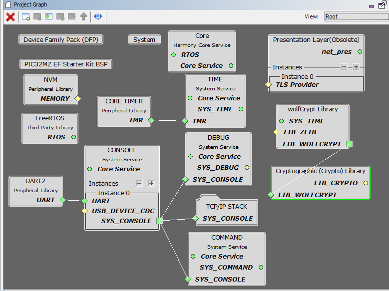
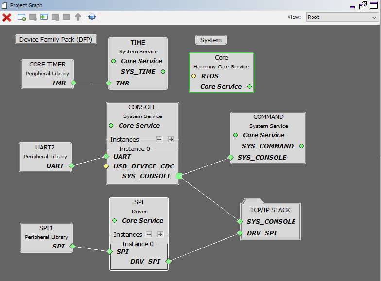
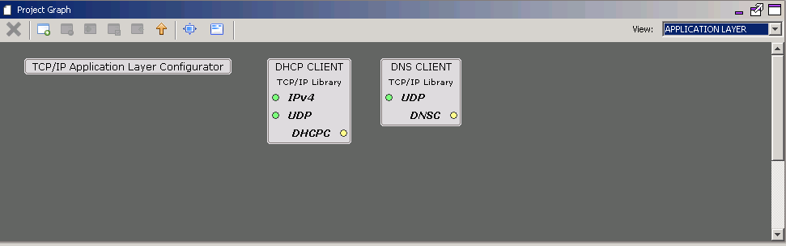
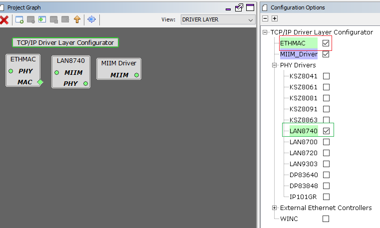
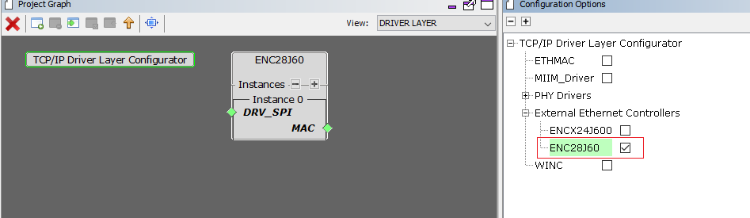
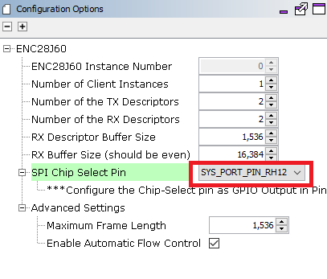
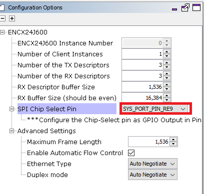

# TCP/IP TCP Server MHC Configuration

The following Project Graph diagram shows the Harmony components included in the TCP Server demonstration application.

* MHC is launched by selecting **Tools > Embedded > MPLAB® Harmony 3 Configurator** from the MPLAB X IDE and after successful database migration , TCP/IP demo project is ready to be configured and regenerated.

    

* **TCP/IP Root Layer Project Graph**

    1. TCP/IP stack module with **internal ethmac**

        The root layer project shows that UART2 peripheral is selected to do read and write operation for TCP/IP commands.

        This is the basic configuration with SYS_CONSOLE, SYS_DEBUG and SYS_COMMAND modules. These modules are required for TCP/IP command execution.

        

        **FreeRTOS** component is required for RTOS application. For bare-metal (non-RTOS) **FreeRTOS** component should not be selected.

        **NOTE** - The above diagram contains **FreeRTOS** component  and that is required for RTOS application. For bare-metal(non-RTOS) **FreeRTOS** component shouldn't be selected.
        
        
        
        TCP sockets calculate the ISN using the wolfSSL crypto library. 

    2. TCP/IP stack module with **external mac daughter board**

         Both ENC28j60 and ENCX24j600 daughter board use SPI1 driver and peripheral to communicate with the PIC32MZ EF controller. -

         

* **TCP/IP Application Layer**

  TCP/IP demo use these application module components for this demo.
  
  **Announce** module to discover the Microchip devices within a local network.
  
  **DHCP Client** module to discover the IPv4 address from the nearest DHCP Server.
  
  **DNS Client** provides DNS resolution capabilities to the stack. 
  

    

* **TCPIP Driver Layer**

    1. **Internal ethernet driver(ethmac)**

          **Internal ethernet driver(ethmac)** is enabled with the external **LAN8740 PHY driver** library. The MIIM Driver supports asynchronous read/write and scan operations for accessing the external PHY registers and notification when MIIM operations have completed.

          

    2. **External ENC28j60 ethernet driver**

        TCP/IP ENC28j60 driver module selected for the external ethernet  mac ENC28j60 device. For high MAC TX and RX performance DRV_ENC28j60_MAC_TX_DESCRIPTORS and DRV_ENC28j60_MAC_RX_DESCRIPTORS can be configured respectively more than the default descriptor value size "2".
        

        GPIO RH12 pin is configured for SPI chip select.

        
        

    3. **External ENCX24j600 ethernet driver**

        TCP/IP ENCx24j600 driver module selected for the external ethernet  mac ENC28j60 device. For high MAC TX and RX performance DRV_ENCX24j600_MAC_TX_DESCRIPTORS and DRV_ENCX24j600_MAC_RX_DESCRIPTORS can be configured respectively more than the default descriptor value size "2".

        

        GPIO RE9 pin is configured for SPI chip select.

        
