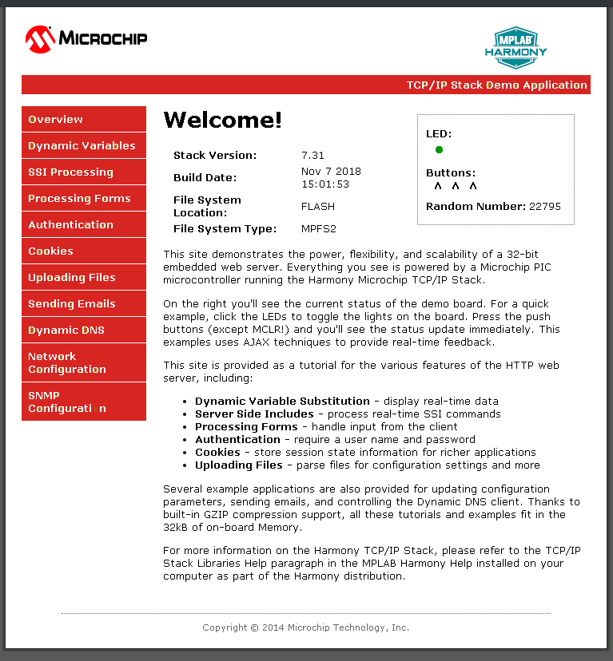

# TCP/IP WEB-NET & FTP SERVER Running Application

This application uses more than one FS for the TCP/IP application demonstration.
Here HTTP Net server uses Microchip Proprietary File System (MPFS) as a read only FS. Here MPFS FS reads web pages from Non-Volatile Memory (NVM) media which is used to store the web server pages.

The FAT FS File System read and writes  to SDCard memory media which is used for storing any type of files. FTP server will read from and write to this SDcard media using FAT FS.

## MPLAB X IDE Project
This table list the name and location of the MPLAB X IDE project folder for the demonstration.

|Project Name|  Target Device|  Target Development Board | Description  |
|:-------------:|:---------:|:---------:|:---------:|
|pic32mz_ef_sk_freertos.X | PIC32MZ2048EFH144 | PIC32MZ EF Starter Kit |Demonstrates the TCP/IP Web Server with more than one FS on a development board with PIC32MZ2048EFH144 device and on-board KSZ8091 PHY. This implementation is based on FreeRTOS.    |
|pic32mz_da_sk.X | PIC32MZ2064DAS169 | PIC32MZ DA Starter Kit |Demonstrates the TCP/IP Web Server with more than one FS on a development board with PIC32MZ2064DAS169 device and on-board LAN8740 PHY. This implementation is based on bare-metal(non-RTOS).    |
|pic32mz_da_sk_freertos.X | PIC32MZ2064DAS169 | PIC32MZ DA Starter Kit |Demonstrates the TCP/IP Web Server with more than one FS on a development board with PIC32MZ2064DAS169 device and on-board LAN8740 PHY. This implementation is based on FreeRTOS.    |

## Running The Demonstration

1. Ensure a microSD/SD card is formatted and loaded with the web pages provided within the < install-dir >/net/apps/web_ftp_server_mpfs_fatfs/firmware/src/web_pages directory.

2. Configure the Development Board as given  **[Configure Hardware](readme_hardware_configuration.md)**.

3. Make the demonstration setup as shown [Network Setup](../../readme.md).

4. Build and download the demonstration project on the target board.

5. If the board has a UART connection:

    1. A virtual COM port will be detected on the computer, when the USB cable is connected to USB-UART connector.

    2. Open a standard terminal application on the computer (like Hyper-terminal or Tera Term) and configure the virtual COM port.

    3. Set the serial baud rate to 115200 baud in the terminal application.

    4. See that the initialization prints on the serial port terminal.

    5. When the DHCP client is enabled in the demonstration, wait for the DHCP server to assign an IP address for the development board. This will be printed on the serial port terminal.

        * Alternatively: Use the Announce service or ping to get the IP address of the board.

   		* Run **tcpip_discoverer.jar** to discover the IPv4 and IPv6 address for the board.

6. Execution:

    An HTTP server is hosted by the demonstration application. Open a web browser and direct it to the board running the HTTP server by typing the URL in the address bar (for example, https://mchpboard_c), and then pressing Enter. 

    The demonstration application features following: 

    Real-time Hardware Control and Dynamic Variables - On the Overview page the LEDs can be clicked to toggle the LEDs on the Microchip hardware development board. The SWITCHes on the Microchip hardware development board can be pressed to toggle the Buttons on the web page. The dynamic variables can be updated in real-time on the HTTP server. 

    **Note:**  For the LED and SWITCH functionality portion of the demonstration, configure the GPIOs connected to LEDs and Switches on Microchip hardware development board, through the Pin Configuration manager in MPLAB® Harmony Configurator (MHC).  

    1. **Form Processing** - Input can be handled from the client by using the GET and POST methods (this functionality controls the on-board LEDs and is operational only on the Explorer 16 Development Board)

    2. **Authentication** - Shows an example of the commonly used restricted access feature 
    
    3. **Cookies** - Shows an example of storing small text strings on the client side 

    4. **Server Side Includes** - An example of how SSI can be used to support dynamic content 

    5. **File Uploads** - Shows an example of a file upload using the POST method. The HTTP server can_accept_a user-defined MPFS/MPFS2 image file for web pages. 
    
    6. **Send E-mail** - Shows simple SMTP POST methods 

    7. **Dynamic DNS** - Exercises Dynamic DNS capabilities 
    
    8. **Network Configuration** - The MAC address, host name, and IP address of the evaluation kit can be viewed in the Network Configuration page and some configurations can be updated 
    
    9. **MPFS Upload** - A new set of web pages can be uploaded to the web server using this feature, which is accessed through http://mchpboard_c/mpfsupload 

    **Notes:**  The location of the MPFS image is fixed at the beginning of the Flash page specified by DRV_MEMORY_DEVICE_START_ADDRESS. The size of the MPFS upload is limited to DRV_MEMORY_DEVICE_MEDIA_SIZE in the demonstration. 
    The HTTP File Upload functionality has to be enabled when the project is generated. 
  
    

7. FTP Server output - 
    
    Also to transfer file , FTP output –

    Open windows command console and enter FTP server IP address (here FTP server IP address - 192.168.100.11) to access the FTP SERVER

    | FTP OUTPUT |
    |-------------|
    | C:\>ftp 192.168.100.11  |   
    |Connected to 192.168.100.11.
    |220 Ready
    |User (192.168.100.11:(none)): Microchip
    |331 Password required
    |Password:
    |230 Logged in
    |ftp> pwd
    |257 "/" is cwd
    |ftp> dir
    |200 Command Ok
    |125 File status okay; about to open data connection
    |-rwx------ 0 0 0 36 Aug 09 2013 file.txt
    |-rwx------ 0 0 0 12 Aug 09 2013 file1.txt
    |drwx------ 0 0 0 0 Feb 25 2019 System Volume Information
    |-rwx------ 0 0 0 24 Aug 09 2013 file_hs.txt
    |-rwx------ 0 0 0 12 Aug 09 2013 file_hs3.txt
    |-rwx------ 0 0 0 468 Aug 09 2013 file_hs5.txt
    |-rwx------ 0 0 0 42077 Aug 09 2013 Presentation1.pptx
    |drwx------ 0 0 0 0 Jul 16 2019 ATE_EtherCAT_Demo
    |-rwx------ 0 0 0 9287357 Jul 17 2019 ATE_EtherCAT_Demo.7z
    |drwx------ 0 0 0 0 Jul 17 2019 Dell_Laptop_bakcup
    |-rwx------ 0 0 0 979594 Dec 03 2019 IoT Demo.pptx
    |drwx------ 0 0 0 0 Dec 10 2019 wifi_rgb_easy_configuration
    |drwx------ 0 0 0 0 Nov 14 2019 wireless
    |drwx------ 0 0 0 0 Nov 26 2019 test_bypass_http_net_server
    |-rwx------ 0 0 0 8186726 Nov 27 2019 test_bypass_http_server_1.zip
    |drwx------ 0 0 0 0 Jan 30 2020 FOE_BinFIle
    |drwx------ 0 0 0 0 Jan 31 2020 FoE_Hex_imagefiles
    |drwx------ 0 0 0 0 Mar 16 2020 exam
    |drwx------ 0 0 0 0 Jun 02 2020 webpages
    |-rwx------ 0 0 0 525 Jun 09 2020 New Volume (D) - Shortcut.lnk
    |226 Closing data connection. Requested file action successful.
    |ftp: 1424 bytes received in 0.20Seconds 7.19Kbytes/sec.
    |ftp> cd webpages
    |250 /webpages/ is new cwd
    |ftp> dir
    |200 Command Ok
    |125 File status okay; about to open data connection
    |drwx------ 0 0 0 0 Jun 02 2020 dyndns
    |drwx------ 0 0 0 0 Jun 02 2020 email
    |drwx------ 0 0 0 0 Jun 02 2020 protect
    |drwx------ 0 0 0 0 Jun 02 2020 snmp
    |-rwx------ 0 0 0 1388 May 03 2019 auth.htm     
    |-rwx------ 0 0 0 2104 Feb 11 2020 cookies.htm     
    |-rwx------ 0 0 0 1986 Feb 11 2020 dynvars.htm     
    |-rwx------ 0 0 0 161 Feb 11 2020 footer.htm     
    |-rwx------ 0 0 0 2068 Feb 11 2020 forms.htm     
    |-rwx------ 0 0 0 2150 Feb 11 2020 harmony.gif     
    |-rwx------ 0 0 0 1232 Feb 11 2020 header.htm     
    |-rwx------ 0 0 0 3798 Feb 11 2020 index.htm     
    |-rwx------ 0 0 0 21 Feb 11 2020 leds.cgi     
    |-rwx------ 0 0 0 3183 Feb 11 2020 mchp.css     
    |-rwx------ 0 0 0 1263 Feb 11 2020 mchp.gif     
    |-rwx------ 0 0 0 3721 Feb 11 2020 mchp.js     
    |-rwx------ 0 0 0 512 Feb 11 2020 snmp.bib     
    |-rwx------ 0 0 0 2032 Feb 11 2020 ssi.htm     
    |-rwx------ 0 0 0 183 Feb 11 2020 status.xml     
    |-rwx------ 0 0 0 970 Feb 11 2020 upload.htm     
    |226 Closing data connection. Requested file action successful.     
    |ftp: 1267 bytes received in 0.17Seconds 7.45Kbytes/sec.     
    |ftp> get mchp.css     
    |200 Command Ok     
    |150 File status okay; about to open data connection     
    |226 Transfer Complete     
    |ftp: 3183 bytes received in 1.42Seconds 2.24Kbytes/sec.     
    |ftp> put ActivityLog.xml     
    |200 Command Ok     
    |150 File status okay; about to open data connection     
    |226 Transfer Complete     
    |ftp: 86262 bytes sent in 0.56Seconds 152.68Kbytes/sec.     
    |ftp> ls     
    |200 Command Ok     
    |125 File status okay; about to open data connection     
    |Date Type FileSize filename     
    |05-03-2019 11:54:24 file 1388 auth.htm     
    |02-11-2020 16:47:38 file 2104 cookies.htm     
    |02-11-2020 16:47:38 file 1986 dynvars.htm     
    |02-11-2020 16:47:38 file 161 footer.htm     
    |02-11-2020 16:47:40 file 2068 forms.htm     
    |02-11-2020 16:47:40 file 2150 harmony.gif     
    |02-11-2020 16:47:40 file 1232 header.htm     
    |02-11-2020 16:47:40 file 3798 index.htm     
    |02-11-2020 16:47:42 file 21 leds.cgi     
    |02-11-2020 16:47:42 file 3183 mchp.css     
    |02-11-2020 16:47:42 file 1263 mchp.gif     
    |02-11-2020 16:47:42 file 3721 mchp.js     
    |02-11-2020 16:47:44 file 512 snmp.bib     
    |02-11-2020 16:47:46 file 2032 ssi.htm     
    |02-11-2020 16:47:46 file 183 status.xml     
    |02-11-2020 16:47:46 file 970 upload.htm     
    |08-09-2013 15:06:00 file 86262 ActivityLog.xml     
    |226 Closing data connection. Requested file action successful.     
    |ftp: 799 bytes received in 0.16Seconds 4.99Kbytes/sec.     
    |ftp>
