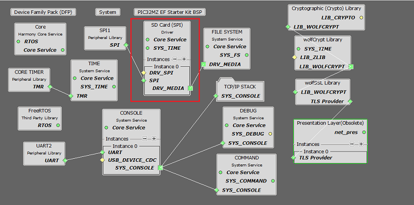
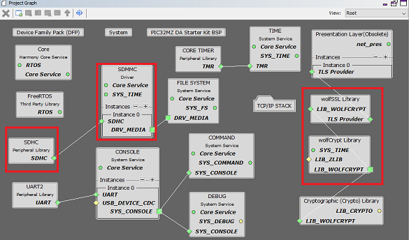
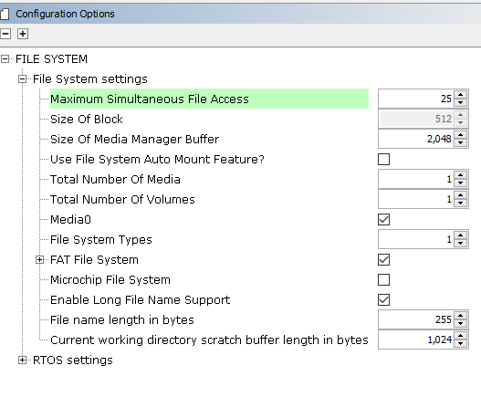
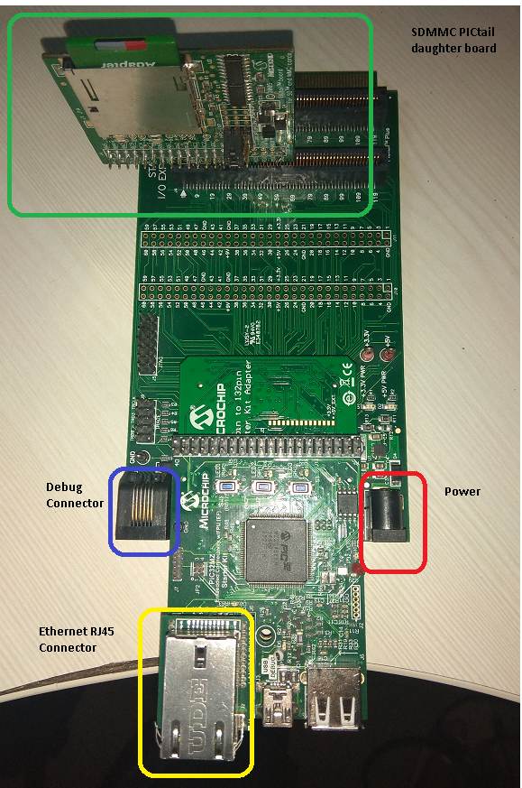
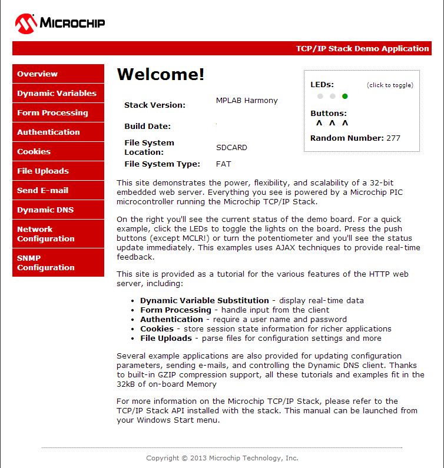

# TCP/IP WEB-NET Server SDCARD FATFS Application

The Web Net Server SDCard configuration demonstrates creating an HTTP web server on a Microchip evaluation board. The FAT FS File System is used for storing the web pages on an external SD Card.

This demonstration uses the HTTP\_NET server which supports encrypted communication through the NET\_PRES layer and an external service provider for TLS support.

**TCP/IP Web NET Server SDCARD FATFS MHC Configuration**

The following Project Graph diagram shows the Harmony components included in the application demonstration.

-   MHC is launched by selecting **Tools \> Embedded \> MPLAB® Harmony 3 Configurator** from the MPLAB X IDE and after successful database migration , TCP/IP demo project is ready to be configured and regenerated.

    

-   **TCP/IP Root Layer Project Graph**

    -   PIC32MZ EF Device performs read/write to an SD card using SDSPI Module

        SDSPI module is selected with SPI peripheral. SDSPI driver uses an instance of the SPI driver to communicate to the SD card over the SPI bus. The TCP/IP application demonstrates FAT file system to read/write to an SD card using SDSPI driver. WebServer demo application use SPI peripheral to read/write from SDMMC module.

        

    -   PIC32MZ DA device performs read/write to an SD card using SDMMC driver. SNMP and WebServer demo applications use SDMMC driver to read/write from SDHC peripheral module.

        

    The TCP/IP application demonstrates FAT file system to read/write to an SD card using SDSPI driver. SNMP and WebServer demo applications use SPI peripheral to read/write from SDMMC module.

    **WolfSSL** component is selected for secure connection which supports TLS v1.3 and **WolfSSL-Crypto** component is selected for MD5 and SHA authentication.

    

    **Wolfssl crypto** module enabled with MD5,SHA authentication and AES encryption/decryption privacy protocol are enabled. Wolfssl library used a open a secured socket.

    **FreeRTOS** component is required for RTOS application. For bare-metal \(non-RTOS\) **FreeRTOS** component should not be selected.

    The FAT file system is selected for this application to read and write from the SDHC\( sdcard \) module. This is the below snapshot for the FAT FS configuration.

    

    TCP sockets calculate the ISN using the wolfSSL crypto library.

-   **TCP/IP Required Application**

    TCP/IP demo use these application module components for this demo.

    **Announce** module to discover the Microchip devices within a local network.

    **DHCP Client** module to discover the IPv4 address from the nearest DHCP Server.

    **HTTPNET** module is selected to run the web\_server for the port number **443**.

    

-   **TCPIP Driver Layer**

    **Internal ethernet driver\(ethmac\)** is enabled with the external **LAN8740 PHY driver** library. The MIIM Driver supports asynchronous read/write and scan operations for accessing the external PHY registers and notification when MIIM operations have completed.

    

**TCP/IP Web NET Server SDCARD FATFS Hardware Configuration**

This is the following section describes the hardware configuration and one of the configuration can be used for this application demonstration.

1.  This section describes the PIC32MZ EF Device hardware configuration with **SDMMC\(Secure Digital/ MultiMediaCard interface\)** interface.

    

-   Refer to the PIC32MZ EF Starter Kit User Guide

-   Refer to the Starter Kit I/O Expansion Board - [DM320002 User Guide](https://www.microchip.com/developmenttools/ProductDetails/DM320002)

-   Refer to the SDMMC PICtail daughter board - [AC164122 User Guide](https://www.microchip.com/developmenttools/ProductDetails/AC164122)

-   Insert the SDMMC PICtail daughter board \(AC164122\) into the SPI1 slot of the I/O Expansion Board \(DM320002\)

-   Insert the PIC32MZ EF Starter Kit into the I/O Expansion Board \(DM320002\)

-   Establish a connection between the router/switch with the PIC32MZ Starter Kit through the RJ45 connector on PHY daughter board. Power the board using the 9V power adapter

-   The demo application is configured for the SPI1 slot, using the following I/O pins:

    |SPI 1|Pin Selection|
    |-----|-------------|
    |SCK1 - SPI clock|RD1|
    |SDI1 - SPI Data Input|RD14|
    |SDO1 - SPI Data Output|RD10|
    |SPI Chip Select|RB1|

1.  This section describes the PIC32MZ DA device default hardware configuration use USB device as **on board debugger and programmer** for this application demonstration.

    -   Refer to the PIC32MZ DA Ethernet Starter Kit [User Guide](http://ww1.microchip.com/downloads/en/DeviceDoc/70005311A.pdf) for the programming/debugging options supported.

        

    -   No hardware related configuration or jumper setting changes are necessary. Connect the mini USB cable from the computer to the USB DEBUG connector on the PIC32MZ DA Ethernet Starter Kit

    -   Connect micro USB cable from the computer to the USB connector\(J4\) on the PIC32MZ DA Starter Kit

    -   Connect micro USB cable from the computer to the USB-UART connector\(J5\) on the PIC32MZ DA Starter Kit

    -   Establish a connection between the router/switch with the PIC32MZ DA Starter Kit through the RJ45 connector on PHY daughter board.

    -   Insert MicroSD Card in the MicroSD Card slot \(J10\) on the development board

**TCP/IP Web NET Server SDCARD FATFS Running Application**

This Web Net Server application uses the SD card as a memory media and reads the web pages stored according to the configured mount path. Web Server reads the external SD card content using FAT FS API.

This table list the name and location of the MPLAB X IDE project folder for the demonstration.

|Project Name|Target Device|Target Development Board|Description|
|------------|-------------|------------------------|-----------|
|pic32mz\_ef\_sk\_freertos.X|PIC32MZ2048EFH144|PIC32MZ EF Starter Kit|Demonstrates the web net server SDCARD FAT FS on development board with PIC32MZ2048EFH144 device and LAN8740 PHY daughter board. This is a FreeRTOS implementation.|
|pic32mz\_da\_sk.X|PIC32MZ2064DAS169|PIC32MZ DA Starter Kit|Demonstrates the web net server SDCARD FAT FS on development board with PIC32MZ2064DAS169 device and LAN8740 PHY daughter board. This is a bare-metal\( non-RTOS \) implementation.|
|pic32mz\_da\_sk\_freertos.X|PIC32MZ2064DAS169|PIC32MZ DA Starter Kit|Demonstrates the web net server SDCARD FAT FS on development board with PIC32MZ2064DAS169 device and LAN8740 PHY daughter board. This is a FreeRTOS implementation.|

1.  Ensure a microSD/SD card is formatted and loaded with the web pages provided within the < install-dir \>/net/apps/web\_net\_server\_sdcard\_fatfs/firmware/src/web\_pages directory.

**Running Demonstration Steps**

1.  Build and download the demonstration project on the target board.

2.  If the board has a UART connection:

    1.  A virtual COM port will be detected on the computer, when the USB cable is connected to USB-UART connector.

    2.  Open a standard terminal application on the computer \(like Hyper-terminal or Tera Term\) and configure the virtual COM port.

    3.  Set the serial baud rate to 115200 baud in the terminal application.

    4.  See that the initialization prints on the serial port terminal.

    5.  When the DHCP client is enabled in the demonstration, wait for the DHCP server to assign an IP address for the development board. This will be printed on the serial port terminal.

        -   Alternatively: Use the Announce service or ping to get the IP address of the board.

        -   Run **tcpip\_discoverer.jar** to discover the IPv4 and IPv6 address for the board.

3.  Execution:

    An HTTP server is hosted by the demonstration application. Open\_a web browser and direct it to the board running the HTTP server by typing the URL in the address bar \(for example, https://mchpboard\_c\), and then pressing Enter.

    The demonstration application features following:

    Real-time Hardware Control and Dynamic Variables - On the Overview page the LEDs can be clicked to toggle the LEDs on the Microchip hardware development board. The SWITCHes on the Microchip hardware development board can be pressed to toggle the Buttons on the web page. The dynamic variables can be updated in real-time on the HTTP server.

    **Note:** For the LED and SWITCH functionality portion of the demonstration, configure the GPIOs connected to LEDs and Switches on Microchip hardware development board, through the Pin Configuration manager in MPLAB® Harmony Configurator \(MHC\).

    1.  **Form Processing** - Input can be handled from the client by using the GET and POST methods \(this functionality controls the on-board LEDs and is operational only on the Explorer 16 Development Board\)

    2.  **Authentication** - Shows an example of the commonly used restricted access feature

    3.  **Cookies** - Shows an example of storing small text strings on the client side

    4.  **Server Side Includes** - An example of how SSI can be used to support dynamic content

    5.  **File Uploads** - Shows an example of a file upload using the POST method. The HTTP server can\_accept\_a user-defined MPFS/MPFS2 image file for web pages.

    6.  **Send E-mail** - Shows simple SMTP POST methods

    7.  **Dynamic DNS** - Exercises Dynamic DNS capabilities

    8.  **Network Configuration** - The MAC address, host name, and IP address of the evaluation kit can be viewed in the Network Configuration page and some configurations can be updated

    9.  **MPFS Upload** - A new set of web pages can be uploaded to the web server using this feature, which is accessed through http://mchpboard\_c/mpfsupload

    

**Parent topic:**[MPLAB® Harmony 3 TCP/IP Application for PIC32MZ Family](../../docs/GUID-E3619664-D1A4-427D-A50A-7CBF1634F410.md)

