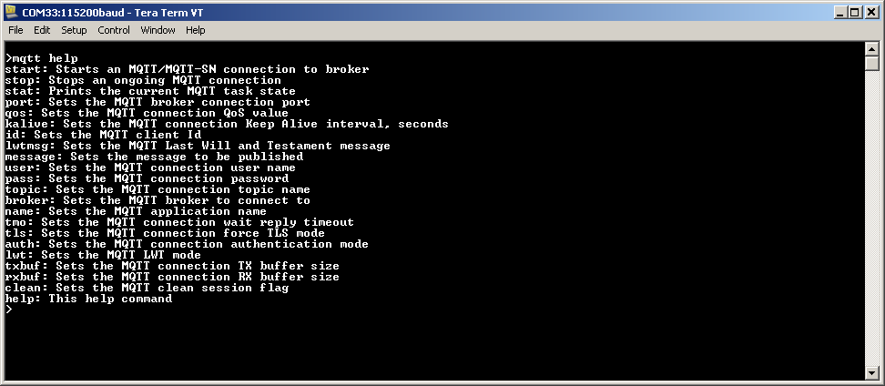
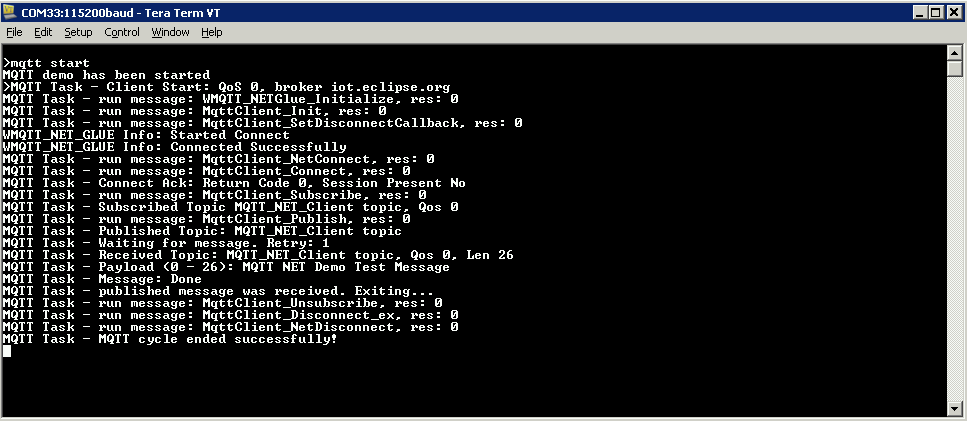

# TCP/IP WolfSSL MQTT Running Application

## MPLAB X IDE Project
This table list the name and location of the MPLAB X IDE project folder for the demonstration.

|Project Name|  Target Device|  Target Development Board | Description  |
|:-------------:|:---------:|:---------:|:---------:|
|pic32mz_ef_sk.X  | PIC32MZ2048EFM144  | PIC32MZ EF Starter Kit | Demonstrates the wolfMQTT on a development board with PIC32MZ2048EFH144 device and LAN8740 PHY daughter board. This is a bare-metal (non-RTOS) implementation.   |
|pic32mz_ef_sk_freertos.X | PIC32MZ2048EFH144 | PIC32MZ EF Starter Kit | Demonstrates the wolfMQTT on development board with PIC32MZ2048EFH144 device and LAN8740 PHY daughter board. This implementation is based on FreeRTOS. |

## Running The Demonstration

1. Configure the Development Board as given  **[Configure Hardware](readme_hardware_configuration.md)**.

2. Make the demonstration setup as shown [Network Setup](../../readme.md).

3. Build and download the demonstration project on the target board.

4. If the board has a UART connection:

    1. A virtual COM port will be detected on the computer, when the USB cable is connected to USB-UART connector.

    2. Open a standard terminal application on the computer (like Hyper-terminal or Tera Term) and configure the virtual COM port.

    3. Set the serial baud rate to 115200 baud in the terminal application.

    4. See that the initialization prints on the serial port terminal.

    5. When the DHCP client is enabled in the demonstration, wait for the DHCP server to assign an IP address for the development board. This will be printed on the serial port terminal.

		* Alternatively: Use the Announce service or ping to get the IP address of the board.

        * Run **tcpip_discoverer.jar** to discover the IPv4 and IPv6 address for the board.
        
5. Execution :

    The wolfMQTT demo is interactive, using a set of special MQTT commands that have been added to this demo.

    Pressing "mqtt help" at the command prompt displays the list of the available commands/options:

6. Most of the commands are self explanatory.

    All settings come with default values.

    A brief description of the most important settings/commands follows:

    

  - "mqtt broker": sets the MQTT broker to connect to. The default value is "iot.eclipse.org"

  - "mqtt port": sets the MQTT port to use. Default is 1883

  - "mqtt qos": setd the QoS. Default is MQTT_QOS_0.

  - "mqtt topi": sets the MQTT topic. Default is "MQTT_NET_Client topic"

  - "mqtt tls": sets the force TLS flag. Default is 0.

  - "mqtt user": sets the user name. Default is "MQTT_NET_User"

  - "mqtt txbuf": sets the size of the TX buffer for the connection. Default is 1024

  - "mqtt rxbuf": sets the size of the RX buffer for the connection. Default is 1024

**Note:** The connection to the broker is normally done using the port number: 1883 for plain connections, 8883 for encrypted ones.

9. Wolf MQTT Connection:

    Using the "force TLS" will force an encrypted connection regardless of the port number.

    The wolfMQTT demo is based on the examples provided by wolfMQTT.

    To allow a simple usage of the wolfMQTT library, a wolfMQTT NET Glue layer has been added to the Harmony port,

    The NET glue layer takes care of all the connections to the broker, supporting both encrypted and plain connections.

    This way the application does not have to be concerned with the communication mechanisms and can use directly the wolfMQTT API on a Harmony platform without the need to add other supporting code.

    The configuration parameters for the wolfmqtt demonstration are defined in the app_mqtt_task.h file that's part of the project.

    The configuration parameters for the NET glue layer can be configured with MHC (see MHC Configuration).

    The demo starts with all parameters having default values (see above).

    If needed, parameters can be adjusted as the application requires.

    Then a connection to the broker can be started using the command: "mqtt start".

    A successful connection should render the following output:

    The "mqtt stop" command can be used to request the ongoing MQTT transaction to be aborted.

    The "mqtt stat" can be used to display the current state of the MQTT connection cycle.

    
