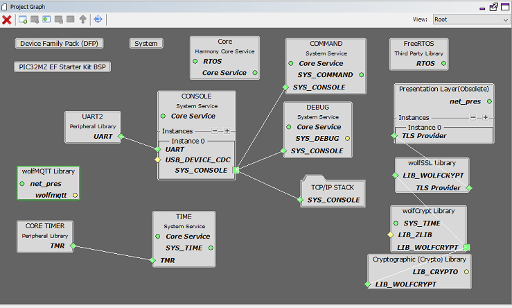
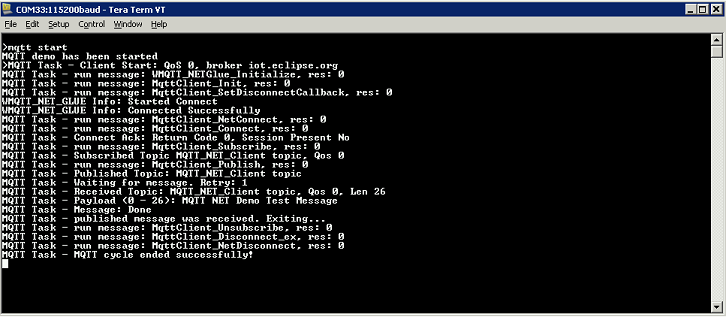

# TCP/IP WolfSSL MQTT Application

The wolfMQTT application demonstrates a simple MQTT application using the 3rd party wolfMQTT library.

The application uses the console to implement a simple set of commands to start a MQTT connection to a selected broker.

The connection parameters can be adjusted using various MQTT related commands.

This demonstration uses the NET\_PRES layer which supports encrypted communication through an external service provider for TLS support \(usually wolfSSL\).

**TCP/IP TCP WolfSSL Client MHC Configuration**

The following Project Graph diagram shows the Harmony components included in the TCP Client demonstration application.

-   MHC is launched by selecting **Tools \> Embedded \> MPLAB® Harmony 3 Configurator** from the MPLAB X IDE and after successful database migration , TCP/IP demo project is ready to be configured and regenerated.

    

-   **TCP/IP Root Layer Project Graph**

    The root layer project shows that UART2 peripheral is selected to do read and write operation for TCP/IP commands.

    This is the basic configuration with SYS\_CONSOLE, SYS\_DEBUG and SYS\_COMMAND modules. These modules are required for TCP/IP command execution.

    

    **NOTE:-****FreeRTOS** component is required for RTOS application. For bare-metal \(non-RTOS\) **FreeRTOS** component should not be selected.

    TCP sockets calculate the ISN using the wolfSSL crypto library.

    The below snapshot provides the details of the wolfssl\_crypto, wolfSSL and presentation layer configuration.

    

    The configuration options for the wolfMQTT are the standard ones supported by wolfMQTT \(see wolfMQTT site\). Note that the project has already selected the 3rd party wolfMQTT and wolfSSL libraries \(for supporting encrypted connections\).

    The NET\_PRES layer is also needed because the Harmony wolfMQTT NET glue layer uses the NET\_PRES to handle the connections to the broker.

    In order to regenerate the project after changes have been made, the wolfSSL libraries need to be downloaded and present at the Harmony 3 \[/topic/body/ul/li/p/install-dir \{"- topic/install-dir "\}\)/wolfMQTT/ and \[/topic/body/ul/li/p/install-dir/install-dir \{"- topic/install-dir "\}\)/wolfSSL/ respectively, at the same level with \[/topic/body/ul/li/p/install-dir/install-dir/install-dir \{"- topic/install-dir "\}\)/net/.\(install-dir\]    Use the github repositories for wolfMQTT and wolfSSL.
    
        To configure the wolfMQTT and the wolfMWQTT NET glue layer, select the "wolfMQTT Library" module:
    
        
    
        The configuration options for the wolfMQTT NET glue allow the application to:
    
        -   force TLS mode
    
        -   enable IPv6 operation
    
        -   set the maximum length of the MQTT broker
    
        -   enable the NET glue debug and debug strings
    
        -   set the allocation functions
    
        -   set the MQTT TX and RX buffer sizes
    
        -   generate the custom MQTT application template:
    
        -   the files app\_mqtt\_task.c, app\_mqtt\_task.h and app\_mqtt\_commands.c will be added to the project
    
    \(install-dir\]\(install-dir\]

    **NOTE:-** The above diagram shows that the **Hardware cryptography** is disabled for wolfssl\_crypto configuration. To work with Hardware cryptography, the Hardware cryptography should be enabled wolfssl\_crypto Configuration.

    -   **TCP/IP Required Application**

        TCP/IP demo use these application module components for this demo. **Announce** module to discover the Microchip devices within a local network. **DHCP Client** module to discover the IPv4 address from the nearest DHCP Server.**DNS Client** provides DNS resolution capabilities to the stack. During these components selection, the required transport and network modules are also selected.

        

    -   **TCPIP Driver Layer**

        **Internal ethernet driver\(ethmac\)** is enabled with the external **LAN8740 PHY driver** library. The MIIM Driver supports asynchronous read/write and scan operations for accessing the external PHY registers and notification when MIIM operations have completed.

        

    **TCP/IP TCP WolfSSL Client Hardware Configuration**

    This is the following section describes the hardware configurations and one of the configuration can be used for this application demonstration.

    1.  This section describes the PIC32MZ EF device default hardware configuration use USB device as **on board debugger and programmer** for this application demonstration.

        -   Refer to the PIC32MZ EF Ethernet Starter Kit [User Guide](http://ww1.microchip.com/downloads/en/devicedoc/70005230b.pdf)

            

        -   No hardware related configuration or jumper setting changes are necessary. Connect the mini USB cable from the computer to the USB DEBUG connector on the PIC32MZ EF Ethernet Starter Kit

        -   Connect the mini USB cable from the computer to the USB-UART connector on the PIC32MZ EF Starter Kit

        -   Establish a connection between the router/switch with the PIC32MZ EF Starter Kit through the RJ45 connector on PHY daughter board

    2.  This section describes the PIC32MZ EF device hardware configuration with the combination of **RealICE, or ICD4** and the Starter Kit I/O Expansion Board for debugging and programming for this application demonstration.

        

        -   Connect the 168 pin to 132 pin Starter Kit Adapter board to the Starter Kit I/O Expansion Board, optionally use a nylon nut and bolt to secure the two boards together

        -   Connect the PIC32MZ Extended Connectivity w/FPU \(EF\) Starter kit to the 168 pin to 132 pin Starter Kit Adapter board, optionally use a nylon nut and bolt to secure the two boards together

        -   Connect the RealICE, or ICD to the RJ-11 port on the Starter Kit I/O Expansion Board

        -   Connect a USB Mini-b \(5 pin\) cable to the DEBUG USB port connect an Ethernet cable to the Ethernet Port

        -   Connect the 9V power supply to the Starter Kit I/O Expansion Board

    **TCP/IP WolfSSL MQTT Running Application**

    This table list the name and location of the MPLAB X IDE project folder for the demonstration.

    |Project Name|Target Device|Target Development Board|Description|
    |------------|-------------|------------------------|-----------|
    |pic32mz\_ef\_sk.X|PIC32MZ2048EFM144|PIC32MZ EF Starter Kit|Demonstrates the wolfMQTT on a development board with PIC32MZ2048EFH144 device and LAN8740 PHY daughter board. This is a bare-metal \(non-RTOS\) implementation.|
    |pic32mz\_ef\_sk\_freertos.X|PIC32MZ2048EFH144|PIC32MZ EF Starter Kit|Demonstrates the wolfMQTT on development board with PIC32MZ2048EFH144 device and LAN8740 PHY daughter board. This implementation is based on FreeRTOS.|

    **Running Demonstration Steps**

    1.  Build and download the demonstration project on the target board.

    2.  If the board has a UART connection:

        1.  A virtual COM port will be detected on the computer, when the USB cable is connected to USB-UART connector.

        2.  Open a standard terminal application on the computer \(like Hyper-terminal or Tera Term\) and configure the virtual COM port.

        3.  Set the serial baud rate to 115200 baud in the terminal application.

        4.  See that the initialization prints on the serial port terminal.

        5.  When the DHCP client is enabled in the demonstration, wait for the DHCP server to assign an IP address for the development board. This will be printed on the serial port terminal.

            -   Alternatively: Use the Announce service or ping to get the IP address of the board.

            -   Run **tcpip\_discoverer.jar** to discover the IPv4 and IPv6 address for the board.

    3.  Execution :

        The wolfMQTT demo is interactive, using a set of special MQTT commands that have been added to this demo.

        Pressing "mqtt help" at the command prompt displays the list of the available commands/options:

    4.  Most of the commands are self explanatory.

        All settings come with default values.

        A brief description of the most important settings/commands follows:

        

    -   "mqtt broker": sets the MQTT broker to connect to. The default value is "iot.eclipse.org"

    -   "mqtt port": sets the MQTT port to use. Default is 1883

    -   "mqtt qos": setd the QoS. Default is MQTT\_QOS\_0.

    -   "mqtt topi": sets the MQTT topic. Default is "MQTT\_NET\_Client topic"

    -   "mqtt tls": sets the force TLS flag. Default is 0.

    -   "mqtt user": sets the user name. Default is "MQTT\_NET\_User"

    -   "mqtt txbuf": sets the size of the TX buffer for the connection. Default is 1024

    -   "mqtt rxbuf": sets the size of the RX buffer for the connection. Default is 1024

    **Note:** The connection to the broker is normally done using the port number: 1883 for plain connections, 8883 for encrypted ones.

    1.  Wolf MQTT Connection:

        Using the "force TLS" will force an encrypted connection regardless of the port number.

        The wolfMQTT demo is based on the examples provided by wolfMQTT.

        To allow a simple usage of the wolfMQTT library, a wolfMQTT NET Glue layer has been added to the Harmony port,

        The NET glue layer takes care of all the connections to the broker, supporting both encrypted and plain connections.

        This way the application does not have to be concerned with the communication mechanisms and can use directly the wolfMQTT API on a Harmony platform without the need to add other supporting code.

        The configuration parameters for the wolfmqtt demonstration are defined in the app\_mqtt\_task.h file that's part of the project.

        The configuration parameters for the NET glue layer can be configured with MHC \(see MHC Configuration\).

        The demo starts with all parameters having default values \(see above\).

        If needed, parameters can be adjusted as the application requires.

        Then a connection to the broker can be started using the command: "mqtt start".

        A successful connection should render the following output:

        The "mqtt stop" command can be used to request the ongoing MQTT transaction to be aborted.

        The "mqtt stat" can be used to display the current state of the MQTT connection cycle.

        

**Parent topic:**[MPLAB® Harmony 3 TCP/IP Application for PIC32MZ Family](../../docs/GUID-E3619664-D1A4-427D-A50A-7CBF1634F410.md)

