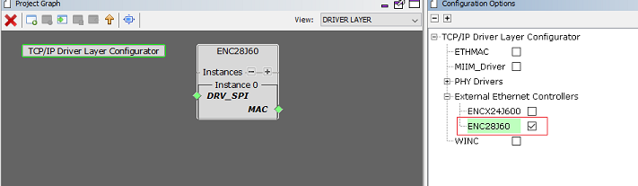
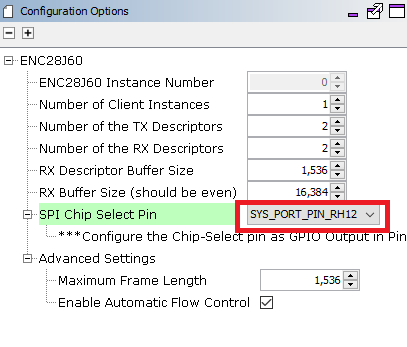
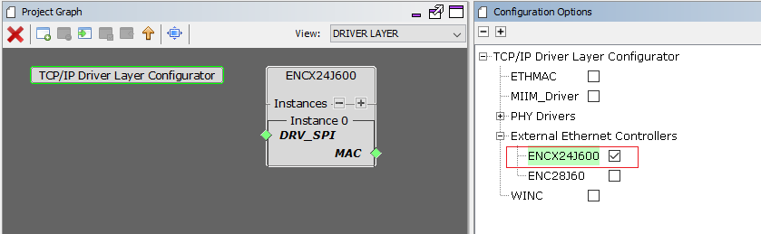
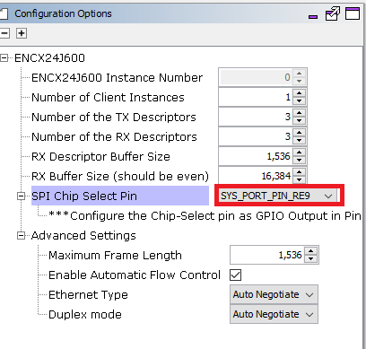
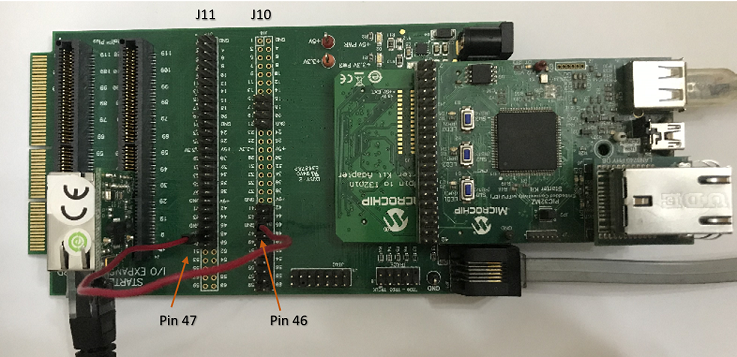
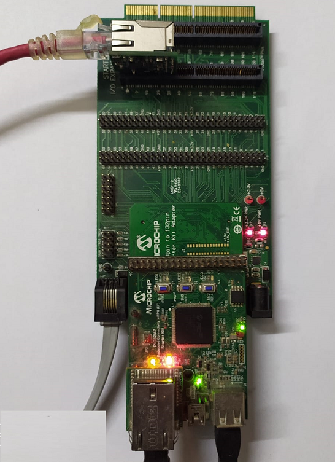
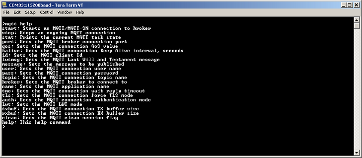
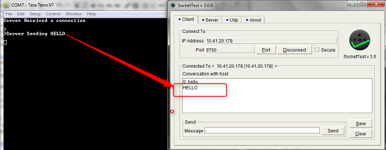

# TCP/IP TCP Server Application

The TCP/IP TCP Server configuration demonstrates creating a network server that uses the MPLAB Harmony TCP API to create a TCP/IP echo server on port 9760.

**TCP/IP TCP Server MHC Configuration**

The following Project Graph diagram shows the Harmony components included in the TCP Server demonstration application.

-   MHC is launched by selecting **Tools \> Embedded \> MPLAB® Harmony 3 Configurator** from the MPLAB X IDE and after successful database migration , TCP/IP demo project is ready to be configured and regenerated.

    

-   **TCP/IP Root Layer Project Graph**

    1.  TCP/IP stack module with **internal ethmac**

        The root layer project shows that UART2 peripheral is selected to do read and write operation for TCP/IP commands.

        This is the basic configuration with SYS\_CONSOLE, SYS\_DEBUG and SYS\_COMMAND modules. These modules are required for TCP/IP command execution.

        

        **FreeRTOS** component is required for RTOS application. For bare-metal \(non-RTOS\) **FreeRTOS** component should not be selected.

        **NOTE** - The above diagram contains **FreeRTOS** component and that is required for RTOS application. For bare-metal\(non-RTOS\) **FreeRTOS** component shouldn't be selected.

        

        TCP sockets calculate the ISN using the wolfSSL crypto library.

    2.  TCP/IP stack module with **external mac daughter board**

        Both ENC28j60 and ENCX24j600 daughter board use SPI1 driver and peripheral to communicate with the PIC32MZ EF controller. -

        

-   **TCP/IP Application Layer**

    TCP/IP demo use these application module components for this demo.

    **Announce** module to discover the Microchip devices within a local network.

    **DHCP Client** module to discover the IPv4 address from the nearest DHCP Server.

    **DNS Client** provides DNS resolution capabilities to the stack.

    

-   **TCPIP Driver Layer**

    1.  **Internal ethernet driver\(ethmac\)**

        **Internal ethernet driver\(ethmac\)** is enabled with the external **LAN8740 PHY driver** library. The MIIM Driver supports asynchronous read/write and scan operations for accessing the external PHY registers and notification when MIIM operations have completed.

        

    2.  **External ENC28j60 ethernet driver**

        TCP/IP ENC28j60 driver module selected for the external ethernet mac ENC28j60 device. For high MAC TX and RX performance DRV\_ENC28j60\_MAC\_TX\_DESCRIPTORS and DRV\_ENC28j60\_MAC\_RX\_DESCRIPTORS can be configured respectively more than the default descriptor value size "2". 

        GPIO RH12 pin is configured for SPI chip select.

        

    3.  **External ENCX24j600 ethernet driver**

        TCP/IP ENCx24j600 driver module selected for the external ethernet mac ENC28j60 device. For high MAC TX and RX performance DRV\_ENCX24j600\_MAC\_TX\_DESCRIPTORS and DRV\_ENCX24j600\_MAC\_RX\_DESCRIPTORS can be configured respectively more than the default descriptor value size "2".

        

        GPIO RE9 pin is configured for SPI chip select.

        

**TCP/IP TCP Server Hardware Configuration**

This is the following section describes the hardware configurations and one of the configuration can be used for this application demonstration.

1.  This section describes the PIC32MZ EF device default hardware configuration use USB device as **on board debugger and programmer** for this application demonstration.

    -   Refer to the PIC32MZ EF Ethernet Starter Kit [User Guide](http://ww1.microchip.com/downloads/en/devicedoc/70005230b.pdf)

        

    -   No hardware related configuration or jumper setting changes are necessary. Connect the mini USB cable from the computer to the USB DEBUG connector on the PIC32MZ EF Ethernet Starter Kit

    -   Connect the mini USB cable from the computer to the USB-UART connector on the PIC32MZ EF Starter Kit

    -   Establish a connection between the router/switch with the PIC32MZ EF Starter Kit through the RJ45 connector on PHY daughter board

2.  This section describes the PIC32MZ EF device hardware configuration with the combination of **RealICE, or ICD4** and the Starter Kit I/O Expansion Board for debugging and programming for this application demonstration.

    

    -   Connect the 168 pin to 132 pin Starter Kit Adapter board to the Starter Kit I/O Expansion Board, optionally use a nylon nut and bolt to secure the two boards together

    -   Connect the PIC32MZ Extended Connectivity w/FPU \(EF\) Starter kit to the 168 pin to 132 pin Starter Kit Adapter board, optionally use a nylon nut and bolt to secure the two boards together

    -   Connect the RealICE, or ICD to the RJ-11 port on the Starter Kit I/O Expansion Board

    -   Connect a USB Mini-b \(5 pin\) cable to the DEBUG USB port connect an Ethernet cable to the Ethernet Port

    -   Connect the 9V power supply to the Starter Kit I/O Expansion Board

3.  This section describes PIC32MZ EF device hardware configuration for **external Ethernet controller ENC28J60** with PIC32MZ2048EFH144 development board.

    -   Refer to the PIC32MZ EF Ethernet Starter Kit [User Guide](http://ww1.microchip.com/downloads/en/devicedoc/70005230b.pdf)

    -   Refer to the ENC28j60 External Ethernet PICtail Plus Daughter Board User Guide

    -   Refer to Starter Kit I/O Expansion Board User Guide

    The 10 Mbps Ethernet PICtail Plus Daughter Board is inserted to J2\(or J4\) on the Starter Kit I/O Expansion Board. The J2, PICtail Plus \(SPI\) connector on Ethernet PICtail Plus Daughter Board is attached to I/O Expansion Board. The PICtail daughter board is inserted to use SPI1.

    The PIC32MZ Embedded Connectivity with FPU \(EF\) Starter Kit is connected to J1 on the Starter Kit I/O Expansion board.

    The pin 46 on J10 and pin 47 on J11 \(on I/O Expansion board\) need to be connected to control the Chip-Select \( GPIO RE9 configuration \) line by the PIC32.

    To power the set-up, connect the micro USB cable from the computer to the micro-A/B port J4 on the PIC32MZ EF Starter Kit

    For serial console, connect the mini USB cable from the computer to the USB-UART connector on the PIC32MZ EF Starter Kit

    Please refer to the following figure for GPIO PIN RE9.

    

    Please refer to the following figure for GPIO PIN RH12 \( without Jumper\).

    

4.  This section describes PIC32MZ EF device hardware configuration for **external Ethernet controller ENC624J600** with PIC32MZ2048EFH144 development board.

    -   Refer to the PIC32MZ EF Ethernet Starter Kit [User Guide](http://ww1.microchip.com/downloads/en/devicedoc/70005230b.pdf)

    -   Refer to the ENCX24j600 External Ethernet PICtail Plus Daughter Board User Guide

    -   Refer to Starter Kit I/O Expansion Board User Guide

    The Fast 100Mbps Ethernet PICtail Plus Daughter Board is inserted to J2\(or J4\) on the Starter Kit I/O Expansion Board. The J2, PICtail Plus \(SPI\) connector on Fast 100Mbps Ethernet PICtail Plus Daughter Board is attached to I/O Expansion Board with white arrows on the two boards lined up. The PICtail daughter board is inserted to use SPI1.

    The PIC32MZ Embedded Connectivity with FPU \(EF\) Starter Kit is connected to J1 on the Starter Kit I/O Expansion board.

    The pin 46 on J10 and pin 47 on J11 \(on I/O Expansion board\) need to be connected to control the Chip-Select line by the PIC32.

    To power the set-up, connect the micro USB cable from the computer to the micro-A/B port J4 on the PIC32MZ EF Starter Kit

    For serial console, connect the mini USB cable from the computer to the USB-UART connector on the PIC32MZ EF Starter Kit

    

5.  This section describes the PIC32MZ DA device default hardware configuration use USB device as **on board debugger and programmer** for this application demonstration.

    -   Refer to the PIC32MZ DA Ethernet Starter Kit [User Guide](http://ww1.microchip.com/downloads/en/DeviceDoc/70005311A.pdf) for the programming/debugging options supported.

        

    -   No hardware related configuration or jumper setting changes are necessary. Connect the mini USB cable from the computer to the USB DEBUG connector on the PIC32MZ DA Ethernet Starter Kit

    -   Connect micro USB cable from the computer to the USB connector\(J4\) on the PIC32MZ DA Starter Kit

    -   Connect micro USB cable from the computer to the USB-UART connector\(J5\) on the PIC32MZ DA Starter Kit

    -   Establish a connection between the router/switch with the PIC32MZ DA Starter Kit through the RJ45 connector on PHY daughter board

**TCP/IP TCP Server Running Application**

This table list the name and location of the MPLAB X IDE project folder for the demonstration.

|Project Name|Target Device|Target Development Board|Description|
|------------|-------------|------------------------|-----------|
|pic32mz\_ef\_sk.X|PIC32MZ2048EFH144|PIC32MZ EF Starter Kit|Demonstrates the TCP/IP TCP Server on development board with PIC32MZ2048EFH144 device and LAN8740 PHY daughter board. This implementation is based on without FreeRTOS.|
|pic32mz\_ef\_sk\_freertos.X|PIC32MZ2048EFH144|PIC32MZ EF Starter Kit|Demonstrates the TCP/IP TCP Server on development board with PIC32MZ2048EFH144 device and LAN8740 PHY daughter board. This implementation is based on FreeRTOS.|
|pic32mz\_ef\_sk\_enc28j60.X|PIC32MZ2048EFH144|PIC32MZ EF Starter Kit + External Ethernet Pictail Controller ENC28j60 + I/O Expansion Board|Demonstrates the TCP/IP TCP Server on development board with PIC32MZ2048EFH144 device and external Ethernet controller ENC28J60. This is a bare-metal \(non-RTOS\) implementation|
|pic32mz\_ef\_sk\_enc28j60\_freertos.X|PIC32MZ2048EFH144|PIC32MZ EF Starter Kit + External Ethernet Pictail Controller ENC28j60 + I/O Expansion Board|Demonstrates the TCP/IP TCP Server on development board with PIC32MZ2048EFH144 device and external Ethernet controller ENC28J60. This is with FreeRTOS implementation|
|pic32mz\_ef\_sk\_encx24j600.X|PIC32MZ2048EFH144|PIC32MZ EF Starter Kit + External Ethernet Pictail Controller ENCx24j600 + I/O Expansion Board|Demonstrates the TCP/IP TCP Server on development board with PIC32MZ2048EFH144 device and external Ethernet controller ENCx24j600. This is a bare-metal \(non-RTOS\) implementation|
|pic32mz\_da\_sk.X|PIC32MZ2064DAS169|PIC32MZ DA Starter Kit|Demonstrates the TCP/IP TCP Server on development board with PIC32MZ2064DAS169 device and LAN8740 PHY daughter board. This implementation is based on without FreeRTOS.|
|pic32mz\_da\_sk\_freertos.X|PIC32MZ2064DAS169|PIC32MZ DA Starter Kit|Demonstrates the TCP/IP TCP Server on development board with PIC32MZ2064DAS169 device and LAN8740 PHY daughter board. This implementation is based on FreeRTOS.|

**Running Demonstration Steps**

1.  Build and download the demonstration project on the target board.

2.  If the board has a UART connection:

    1.  A virtual COM port will be detected on the computer, when the USB cable is connected to USB-UART connector.

    2.  Open a standard terminal application on the computer \(like Hyper-terminal or Tera Term\) and configure the virtual COM port.

    3.  Set the serial baud rate to 115200 baud in the terminal application.

    4.  See that the initialization prints on the serial port terminal.

    5.  When the DHCP client is enabled in the demonstration, wait for the DHCP server to assign an IP address for the development board. This will be printed on the serial port terminal.

        -   Alternatively: Use the Announce service or ping to get the IP address of the board.

        -   Run **tcpip\_discoverer.jar** to discover the IPv4 and IPv6 address for the board.

3.  Execution :

    1.  As soon as a valid IP address is assigned through the DHCP to the demonstration, it is ready to accept a TCP/IP connection on port 9760.

    2.  Send a TCP packet to the IP address of the hardware board using port 9760 from any TCP Client application running on the computer.

    3.  The TCP Server demonstration running on the evaluation kit will echo back everything it receives along the connection.

    4.  For TCP Server test, the TCP Client application is required to run on the computer \(SocketTest, Packet Sender etc\). In this demonstration, we use the program, SocketTest \(http://sockettest.sourceforge.net/\). This demonstration is tested with **SocketTest v3.0**.

        -   Open the **SocketTest** software and set the configuration as shown in the following figure.

            

        -   Press the Connect button on the **SocketTest** software after setting the configuration. The serial terminal indicates that the connection has been established.

        -   Type any message in the message box of the **SocketTest** program, and press the Send button. The Server running on the development board will echo back the message to the **SocketTest** program.

            

**Parent topic:**[MPLAB® Harmony 3 TCP/IP Application for PIC32MZ Family](GUID-E3619664-D1A4-427D-A50A-7CBF1634F410.md)

